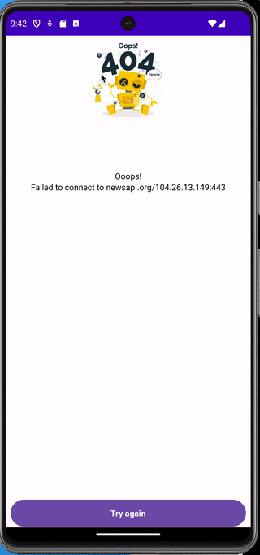

# News API

You can use this project like,  
**REFERENCE** and **INSPIRATION,**  
Please don't **STEAL** my project.

**Use common sense**

Thanks

This an Android Project when you going to see a list of news and if you click in some item, you are going to see a details of this news.

If your device there is biometrics activate you need to authenticate first

There is error screen

I tried to write a project as clean as I could, using the best practices in 2023 in base of SOLID.

- unidirectional flow
- Jetpack Compose
- coroutines flow with StateFlow
- It's prepared for Light/dark mode
- MVVM architecture and I decided to not use the Domain layer in this project.
- Gradle Kotlin DSL
- Gradle plugins
- Flavor in a sub module
- unit tests with MockK
- this project is accessible.

I hope you are enjoying the project.

## To run

I used an Open API, to see this project running you need to access https://newsapi.org and register.  
In the project you need to change the "local.properties" file to add the API key.

## Authors

Bruno Brustoloni e Oliveira

- email: bbrustol@gmail.com
- LinkedIn: [https://www.linkedin.com/in/bbrustol/](http://www.linkedin.com/in/bbrustol)